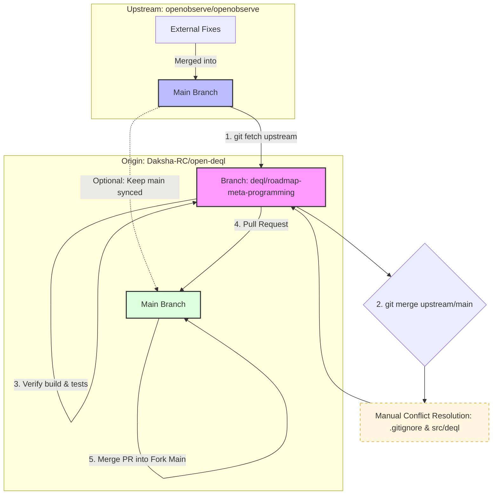

# Developer Guide — Keeping your fork in sync with upstream

This document describes how to keep your fork (`origin: Daksha-RC/open-deql`) in sync with the parent project (`upstream: openobserve/openobserve`) and how to merge upstream changes into a feature branch, verify the build/tests, and open a PR from your fork.

## Diagram


---

## Preconditions

- You have a local clone of your fork:

```bash
git clone git@github.com:Daksha-RC/open-deql.git
cd open-deql
```

- Ensure remotes are configured:

```bash
# origin already points to your fork
git remote -v

# add upstream (if not present)
git remote add upstream git@github.com:openobserve/openobserve.git
git fetch upstream
```

## Step-by-step workflow (commands)

1) Update local refs from upstream

```bash
git fetch upstream --prune
```

2) Switch to your feature branch

```bash
git checkout deql/roadmap-meta-programming
# if it doesn't exist locally
git fetch origin
git checkout -b deql/roadmap-meta-programming origin/deql/roadmap-meta-programming
```

3) Merge upstream `main` into your feature branch (merge flow)

```bash
# Merge (keeps history)
git merge upstream/main

# Resolve conflicts if any, then:
git add <resolved-files>
git commit
```

Alternative: rebase your branch onto upstream/main (linear history)

```bash
# Rebase (rewrites history — you'll force-push afterwards)
git fetch upstream
git rebase upstream/main

# If conflicts happen during rebase:
# edit files, then
git add <resolved-files>
git rebase --continue

# After successful rebase, push with lease
git push --force-with-lease origin deql/roadmap-meta-programming
```

Notes on merge vs rebase:
- `merge` preserves the original branch topology and adds a merge commit.
- `rebase` produces a linear history but requires a force-push; use `--force-with-lease` to be safe.

4) Inspect ahead/behind counts and commits (optional)

```bash
# counts: "<behind> <ahead>"
git rev-list --left-right --count upstream/main...deql/roadmap-meta-programming

# show commits that will be included in PR (ahead of upstream/main)
git log --oneline upstream/main..deql/roadmap-meta-programming
```

5) Resolve conflicts (tips)

- Use `git status` to see conflicted files.
- Open conflict markers `<<<<<<<`, `=======`, `>>>>>>>` and edit.
- After editing, `git add <file>` and `git commit` (merge) or `git rebase --continue` (rebase).
- Optionally use a mergetool:

```bash
git mergetool
```

Be careful merging `.gitignore` and `src/deql/*` — the latter may contain large new files from the feature crate.

6) Verify build and tests locally

```bash
# Verify main build without feature (sanity)
cargo build

# Verify with deql feature enabled
cargo build --features deql

# Run parser crate tests
cargo test -p o2-deql

# Optionally run integration tests that use the feature
cargo test --features deql
```

7) Push the updated feature branch to your fork

```bash
git push origin deql/roadmap-meta-programming
```

8) Open a Pull Request

Option A — with `gh` (GitHub CLI):

```bash
gh pr create --base main --head Daksha-RC:deql/roadmap-meta-programming \
  --title "Implement Phase 1 `o2-deql` crate foundation (parser, core types, error models, API stubs)" \
  --body "See .ai-meta/specs/phase1-create-foundation/PHASE1_CRATE_FOUNDATION.md for details."
```

Option B — via GitHub web UI: push branch (step 7) then open PR on GitHub.

## Best practices and tips

- Prefer using feature branches for development — do not work directly on `main`.
- Use `git.fetch` frequently and rebase/merge small batches of upstream changes rather than huge monolithic merges.
- When rebasing, use `--force-with-lease` to avoid overwriting others' work.
- Run `cargo build --features deql` and unit tests for `o2-deql` before opening PRs.
- If the branch contains many single-file commits created via API calls, consider squashing into a single logical commit before opening the PR:

```bash
git checkout deql/roadmap-meta-programming
git rebase -i upstream/main
# mark intermediate commits as `s` (squash)
git push --force-with-lease origin deql/roadmap-meta-programming
```

## Quick checklist before creating PR

- [ ] All conflicts resolved
- [ ] `cargo build --features deql` succeeds
- [ ] Parser unit tests pass: `cargo test -p o2-deql`
- [ ] Branch pushed to `origin`
- [ ] PR title, body and reviewers set

---

If you want, I can now run the exact commands in your workspace (fetch/merge/build) and report back, or create a shell script that automates the safe fetch/merge/test sequence. Which would you like?
